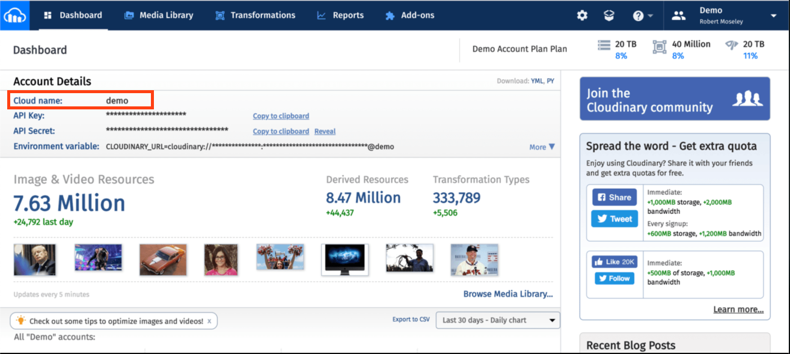

## Cloudinary Configuration Steps
1. Log in to Cloudinary and find your Cloud Name here

2. Enable Unsigned Uploads
3. Obtain a Preset Name that allows unsigned uploads.  This is found under "Settings -> Uploads"

---

!!! Note
When the preset is created, it will have a "name" associated with it.  Use this name in the "Upload Preset" field in Obisidan
!!!

4. When configuring the upload preset folder name, you can leave this blank to have the pictures uploaded to the root of your Cloudinary Media Library.  If you do put a folder name in this field, all images will be stored in a subdirectory of that name in your Media Library.

!!! Note
If you have a folder name already configured on Cloudinary under the settings for your specific upload preset (can be configured on Cloudinary itself), this folder setting will be ignored.
!!!

## Cloudinary and Potential Duplicate Uploads
I recommend double-checking all of your Cloudinary Upload Preset settings before you begin to use the plugin.
[!ref Cloudinary Duplication](cloudinary-duplication.md)

Continue to [Plugin Commands](plugin-commands.md)