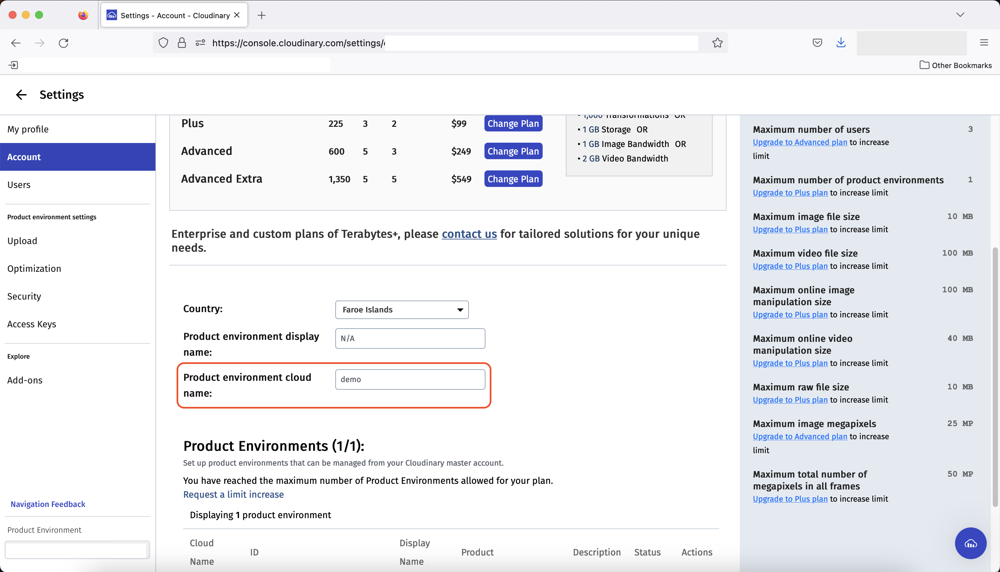

## Cloudinary Confiuration Steps
1. Log in to Cloudinary and find your Cloud Name here

2. Add Upload Preset This is found under `Settings / Uploads`

3. Check Preset This is found under `Settings / Uploads`

4. When configuring the `Global Upload Preset` is a **must**, you can leave `Global Upload Folder` blank to have the pictures uploaded to the root of your Media Library.  If you do put a folder name in this field, all images will be stored in a subdirectory of that name in your Media Library.