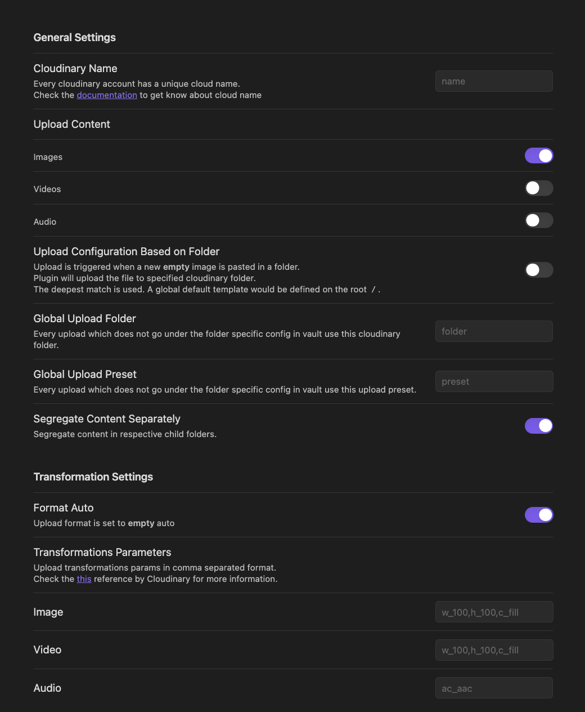

## Configuration Steps

To configure the Plugin, you'll need the following information:
- ### General Settings
  - Cloudinary Cloud Name (_Required_)
    - This is found under `Settings`
  - Upload Content (`Default: images`)
    - If you want to upload other types of content, such as video & audio, you can add them here.
  - Custom Upload Folder
    - If you want to upload to a specific folder in your Cloudinary Media Library, enter the folder name here.  If you leave this blank, all uploads will be stored in the root of your Media Library.
  - Global Cloudinary Upload Preset (_Required_)
    - This is found under `Settings / Uploads`
  - Global Cloudinary Upload Folder
    - If empty it will upload to the root of your Media Library.
  - Segregate Content Separately (`Default: True`)
    - If you want to have each of the content types uploaded to respective folders under the folder you mentioned.
- ### Transformation Settings
  - Format Auto (`Default: True`)
    - If you want to have transformations while rendering the image. (Original files will be uploaded to CDN, Transformation will be applied while fetching the image)
  - Transformation Options
    - Each content type take its own transformation parameters.
    - If you want to have transformations while rendering the image. (Original files will be uploaded to CDN, Transformation will be applied while fetching)
    - [transformation documentation](https://cloudinary.com/documentation/transformation_reference)

Continue to [Configuring Cloudinary](configuring-cloudinary.md)